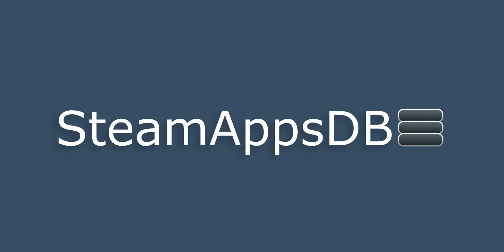

*Python Version == 3.10.1*

## Introduction

SteamAppsDB is a public Web API made with Python. 
It consists of two parts:
- A database management module
- And a public Web API for the database

***

### How the API works

https://steamappsdb.pythonanywhere.com/ -> API documentation 
https://steamappsdb.pythonanywhere.com/GetAppList -> Will return 20 apps sorted by owner count as default

<ins>API Format:</ins> 
/GetApplist?parameter=list,of,comma,seperated,values&another_parameter=...

<ins>API Parameters:</ins>
- tags (tag id's to filter by)
- genres (genre id's to filter by)
- categories (category id's to filter by)
- order (sql column name, sort direction)
- coming_soon (0 or 1)
- release_date (comparison_sign, YYYY-MM-DD )
- index
- limit (0-20)

<ins>SQL Columns:</ins>
- app_id
- name
- release_date
- coming_soon
- positive_reviews
- negative_reviews
- owner_count (speculative value)
- price (not implemented)

<ins>API Examples:</ins> 
To order: 
order = 'owner_count,DESC,release_date,ASC' 
query = /GetAppList?order=owner_count%2CDESC%2Crelease_date%2CASC 

To filter: 
tag_ids_to_filter_by = 18 
genre_ids_to_filter_by = 23,1 
query = /GetAppList?tags=18&genres=23%2C1

***

## Project Overview:

### SteamAppsDB/ :
- main.py: Flask Web API for the apps.db
- setup.py: Sets up the project
- test.py: Unittest for API

### SteamAppsDB/db :
- \__init__.py : Creates apps.db and executes init.sql
- appdata.py : Has AppDetails and AppSnippet classes for intefacing between functions
- applist.json : Raw applist data straight from steam api
(gets updated every time update.py is called)
- apps.db : Database for apps , tags, genres and categories
- database.py : Interface for interacting with database
- errors.py : Custom errors
- init.sql : Initialisation script for sqlite3 database
- update_log.json : Update progress is saved here
- update_logger.py : Class for managing update_log
- update.py : Gets applist from steam, then gets details from steamspy and steam
then saves app details to database

***

## How the Database Gets Updated

db/update.py is the script used for updating the database.
When you run update.py:
1. It gets the list of apps from Steam
2. Iterates over each app:
    - Requests SteamSpy
    - Checks if owner count is smaller than 1 million
    - Reqeusts Steam
    - Checks if app type is 'game' (they can be DLC's)
    - Stores app to database

***

*Disclaimer:*

*This project is a hobby project and is not affiliated with Valve or Steam.* 
*The API provides various information and statistics about Steam applications and* 
*these informations and statistics aren't 100% accurate and not always up to date.* 
*Use it at your own risk.*  
*The app only stores apps that have up to one million owners (approximately).* 
*Owner data is gathered from SteamSpy, which is not an official Steam API.* 
*Steam and the Steam logo are trademarks of Valve Corporation.* 
*All other trademarks are property of their respective owners.*
